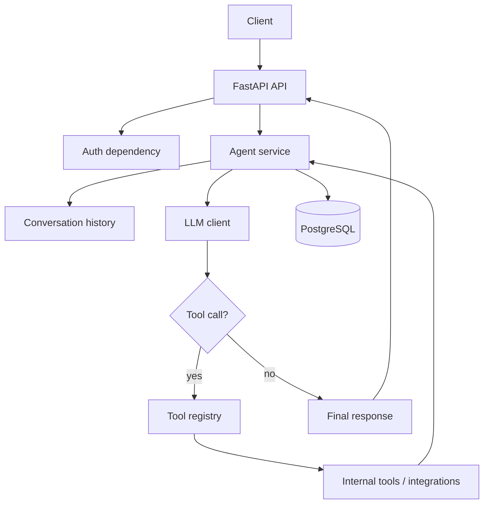

<div align="center">

# AgentHub

**Create AI agents that use tools, run scheduled routines, and log every action.**

[Website](https://agent-hub-webiste.vercel.app/) · [API Docs](#api-overview) · [Getting Started](#getting-started) · [Architecture](#architecture)


</div>

---

## Overview

AgentHub is a backend platform for building autonomous AI agents. Unlike a chatbot that only replies, an AgentHub agent runs a **tool-calling loop**: it reasons, calls tools, reads the results, and continues until the task is complete. Every run and tool action is stored, so users can see exactly what their agents did.

This repository contains the **backend API**. The web frontend lives in a separate repository and consumes the REST API described below.

## Features

- **Secure authentication**: register, login, token refresh, logout, current user
- **Custom agents**: user-scoped CRUD with per-agent instructions and objectives
- **Conversations**: persistent message history and agent runs
- **Custom agent loop**: written from scratch (no agent framework), with max-iteration safety
- **Tool catalog**: 10 tools, enabled or disabled per agent
- **Routines**: manual and scheduled execution with detailed run logs
- **Gmail summaries**: read-only summary tool with controlled scheduled actions
- **Dashboard APIs**: summary, recent runs, recent activity, action items
- **Flexible LLM layer**: deterministic mock for local dev, OpenAI-compatible client for real models
- **Consistent error format** across every endpoint

## Tech Stack

| Layer | Technology |
|---|---|
| API | Python, FastAPI (async) |
| Database | PostgreSQL, SQLAlchemy 2.0 (async), Alembic |
| Validation | Pydantic v2 |
| LLM | OpenAI SDK with AICredits or any OpenAI-compatible provider |
| Tooling | uv, pytest |
| Deployment | Docker, Docker Compose |

## Architecture



Scheduled routines use the same agent service: the scheduler loads an active routine, runs the agent with the routine prompt, and stores the result as a run record.

A full diagram is available in [`docs/architecture.svg`](docs/architecture.svg).

## Getting Started

### Prerequisites

- Python (version specified in `pyproject.toml`)
- [uv](https://docs.astral.sh/uv/)
- Docker and Docker Compose

### Run locally

```bash
# Install dependencies
uv sync

# Create your environment file
cp .env.example .env          # Windows (cmd): copy .env.example .env

# Start PostgreSQL
docker compose up -d postgres

# Apply migrations
uv run alembic upgrade head

# Start the API
uv run uvicorn app.main:app --reload
```

Check that it works:

```bash
curl http://localhost:8000/api/v1/health
```

Interactive docs are served at `http://localhost:8000/docs`.

### Run with Docker

```bash
docker compose up --build
```

### Run tests

```bash
uv run pytest
```

## Configuration

Copy `.env.example` to `.env`. Never commit your `.env` file.

**Local database defaults** (development only, use strong secrets in any deployment):

| Setting | Value |
|---|---|
| Host | `127.0.0.1` |
| Port | `5433` |
| Database | `agenthub` |
| User / Password | `agenthub` / `agenthub` |

**LLM provider.** The default is a deterministic mock, so the app runs with no API key:

```env
LLM_PROVIDER=mock
```

For real models:

```env
LLM_PROVIDER=aicredits
AICREDITS_BASE_URL=<provider-base-url>
AICREDITS_API_KEY=<your-secret-key>
```

Model roles are set with `LLM_MODEL_DEFAULT`, `LLM_MODEL_FAST`, `LLM_MODEL_SMART`, `LLM_MODEL_REASONING`, `LLM_MODEL_CHEAP`, and `LLM_MODEL_EXPERIMENTAL`.

## API Overview

Base path: `/api/v1`. Protected routes need `Authorization: Bearer <access_token>`.

| Group | Endpoints |
|---|---|
| Health | `GET /health` |
| Auth | `POST /auth/register` · `POST /auth/login` · `POST /auth/refresh` · `POST /auth/logout` · `GET /auth/me` |
| Agents | `POST /agents` · `GET /agents` · `GET /agents/{id}` · `PATCH /agents/{id}` · `DELETE /agents/{id}` |
| Conversations | `POST /agents/{id}/conversations` · `GET /agents/{id}/conversations` · `GET /conversations/{id}` · `POST /conversations/{id}/messages` · `POST /conversations/{id}/runs` |
| Tools | `GET /tools` · `GET /agents/{id}/tools` · `PUT /agents/{id}/tools` |
| Routines | `POST /routines` · `GET /routines` · `GET /routines/{id}` · `PATCH /routines/{id}` · `DELETE /routines/{id}` · `POST /routines/{id}/run` · `GET /routines/{id}/runs` |
| Integrations | `GET /integrations/gmail/status` |
| Dashboard | `GET /dashboard/summary` · `GET /dashboard/recent-runs` · `GET /dashboard/recent-activity` · `GET /dashboard/action-items` |

Every error follows one shape:

```json
{
  "error": {
    "code": "string_code",
    "message": "Human readable message",
    "details": {}
  }
}
```

## Security

- Every query is scoped to the authenticated user
- Passwords are hashed, access tokens are short-lived, refresh tokens are revocable
- External integration tokens are never returned to clients
- Secrets are never logged
- Risky tool actions require explicit configuration

## Documentation

- [Milestone plan](docs/milestones.md)
- [Production notes](docs/production.md)
- [Demo script](docs/demo-script.md)

## Roadmap

- More integrations beyond Gmail
- Confirmation-gated actions such as sending email or Slack messages

## License

Add a license file (for example MIT) and reference it here.
