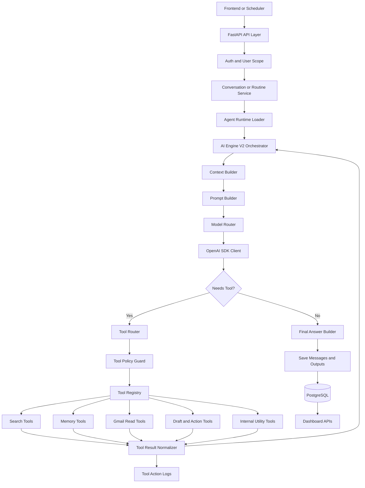
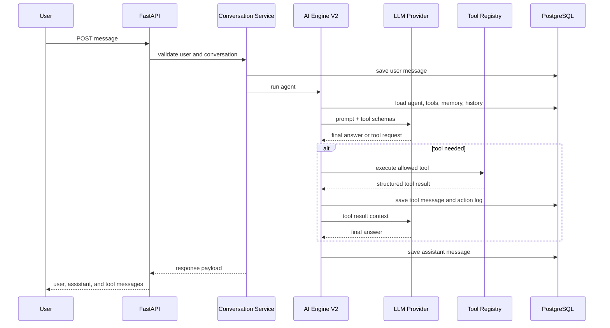
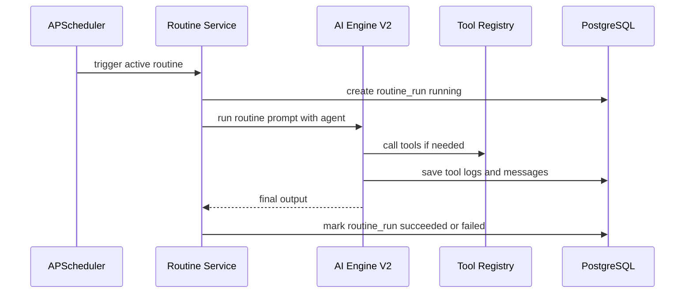
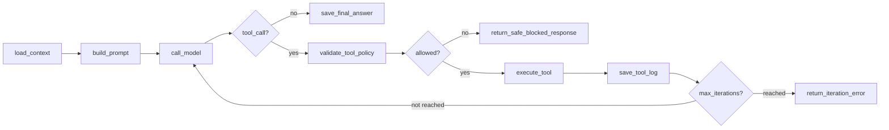

# AI Engine V2 Design

## Purpose

AI Engine V2 is the next evolution of AgentHub's custom MVP agent loop. The goal is to make the engine more reliable, explainable, and interview-ready while still keeping the backend clean.

The engine should let a user create an agent, attach tools, chat with the agent, schedule the agent, and receive saved outputs in the dashboard.

V2 does not mean the product becomes a general AI toy. The product direction stays focused on personal automation for an engineering student, with internship research, Gmail summaries, and safe scheduled tasks as the main MVP examples.

## What The Engine Will Do

- Accept a user message or scheduled routine prompt.
- Load the correct user, agent, conversation, tools, and recent context.
- Decide whether the request needs only an LLM answer or one or more tools.
- Call safe tools such as search, datetime, summarization, Gmail read summary, memory, or draft generation.
- Pass tool results back into the reasoning layer.
- Produce a final answer grounded in tool output.
- Save user messages, assistant messages, tool messages, tool action logs, and routine run outputs.
- Block unsafe external actions unless the user has explicitly configured or confirmed them.
- Return user-facing tool summaries without exposing internal provider names, API routing, keys, debug fields, or fallback details.

## V2 Tech Stack

Current MVP stack stays:

- FastAPI async for APIs
- PostgreSQL for durable state
- SQLAlchemy 2.0 async for ORM
- Alembic for migrations
- Pydantic v2 for typed schemas
- OpenAI Python SDK for OpenAI-compatible LLM calls through AICredits
- APScheduler for scheduled routines
- Pytest and HTTPX for tests
- Docker and Docker Compose for local services

V2 AI orchestration additions:

- LangGraph for explicit agent state graphs, retries, and multi-step orchestration
- LangChain core/tool abstractions only where they reduce glue code
- Existing custom tool registry remains the source of truth for enabled tools and safety metadata
- Existing OpenAI SDK wrapper remains the LLM provider boundary

Important decision:

- LangGraph/LangChain dependencies were added after V2 design approval.
- The first V2 implementation wraps the existing engine instead of deleting it.
- If the framework adds complexity without improving the internship/Gmail/schedule flows, we keep the custom loop.

## System Architecture



## Request Flow

### Chat Request



### Scheduled Routine Request



## End-To-End Orchestration

1. API receives a chat or routine request.
2. Auth dependency resolves the current user.
3. Service layer checks ownership of the agent, conversation, or routine.
4. Runtime loader prepares:
   - agent instructions
   - objective
   - model preference
   - enabled tools
   - recent conversation history
   - memory snippets
   - routine context if applicable
5. Prompt builder creates a compact system prompt with safety rules and tool-use rules.
6. Model router chooses the configured model for the agent or falls back to the default model.
7. LLM is called through the OpenAI SDK provider boundary.
8. If the model asks for a tool, tool router validates:
   - tool exists
   - tool is enabled for that agent
   - user owns the resource
   - action is safe or confirmation-gated
9. Tool executes and returns structured JSON.
10. Tool output is normalized into a safe public shape for chat and dashboard display.
11. Tool result is logged in `tool_action_logs`.
12. Engine sends tool result back to the LLM for final synthesis.
13. Final assistant answer is saved.
14. Dashboard and conversation APIs can read saved outputs.

## Agent State Model

V2 should treat every agent run as a state object:

```text
AgentRunState
├── user_id
├── agent_id
├── conversation_id
├── routine_run_id
├── user_input
├── messages
├── enabled_tools
├── selected_model
├── tool_results
├── safety_flags
├── final_answer
└── error
```

This state can later map cleanly into a LangGraph state graph without changing API contracts.

## Proposed LangGraph Shape



The graph makes the engine easier to explain:

- every box is one node
- every arrow is a controlled transition
- retries and failures become explicit
- tool execution is separated from model reasoning

## Tool Architecture

Tool types:

- Search tools: web search, internship search, current information lookup
- Internal utility tools: datetime, summarization, formatting
- Integration tools: Gmail summary, Slack, Notion, GitHub
- Action tools: draft message, prepare Slack message, future send email
- Memory tools: save memory, get memory, saved reports

Tool contract:

```text
ToolDefinition
├── name
├── description
├── category
├── safety_level
├── requires_confirmation
└── parameters
```

Execution contract:

```text
ToolExecutionResult
├── name
├── input
├── output
├── error
└── succeeded
```

Rules:

- The LLM can only see tools enabled for the current agent.
- The backend validates every tool call even if the LLM requested it.
- Read-only tools can run automatically.
- Draft tools can prepare content automatically.
- External send/delete/apply actions require confirmation or explicit safe configuration.
- Search tools should expose `web_search`, `query`, result titles, snippets, and URLs to the frontend. Provider names and fallback internals stay hidden.

## Prompting Strategy

V2 prompting should be split into small prompt blocks:

- identity: what this agent is
- objective: what success means for this agent
- available tools: exact tool names and when to use them
- freshness rules: use search for latest/current data
- safety rules: never perform dangerous actions without approval
- output contract: answer clearly, cite tool results when useful

This keeps prompts easier to test and improves interview explanation.

## Model Strategy

The system should support multiple configured models:

- default general model
- fast/cheap model for simple drafting and summarization
- stronger model for multi-step research
- future fallback model if the selected model fails

Model choice should be stored on the agent so different agents can use different models.

## Safety And Observability

Required safeguards:

- max iteration limit
- user ownership checks
- enabled-tool checks
- confirmation gate for external actions
- structured tool logs
- routine run status logs
- no secrets in prompts, logs, or API responses
- user-readable tool errors

Observability records:

- model selected
- tool names called
- tool status
- routine status
- error message without secrets
- final output saved for dashboard use

Frontend telemetry rule:

- Show only real execution state, selected model, enabled tools, current streaming/tool activity, and saved output metadata.
- Do not show fake timestamps, fake token counts, fake costs, or provider/debug traces.

## Implementation Phases

### Phase 1: V2 Design And Docs

- Document architecture and request flow.
- Decide framework boundary.
- Keep existing custom loop stable.

### Phase 2: Runtime State Refactor

- Add a typed `AgentRunState`.
- Split loop into small functions/nodes.
- Preserve existing API responses and tests.

### Phase 3: Prompt And Tool Reliability

- Improve prompt blocks.
- Improve deterministic routing for freshness/search/tool requests.
- Normalize tool result JSON.
- Add tests for tool-choice behavior.

### Phase 4: Optional LangGraph Integration

- Add LangGraph only after approval. Status: started.
- Map existing functions into graph nodes. Status: initial graph runner added.
- Keep tool registry and safety policy as backend-owned code.
- Compare behavior against existing tests.

### Phase 5: Advanced Agent Features

- retries
- fallbacks
- better memory retrieval
- richer routine outputs
- confirmation workflow for external actions

### Phase 6: Frontend Chat Experience

- Auto-create the first conversation when a user starts chatting.
- Let users delete/clear a conversation from the chat screen.
- Show tool-call cards first, then progressively render the assistant response.
- Refresh agent/chat query state after edits so the next run uses updated instructions, model, and tools.
- Provide Quick Run starter agents for empty workspaces.
- Provide a Quick Test routine flow that creates a sample routine and runs it immediately.

## Interview Explanation

Short version:

AgentHub's AI engine is an orchestrator around an LLM. The LLM does not directly control the app. The backend loads user-scoped context, exposes only allowed tools, validates every tool call, executes tools safely, logs the action, and then asks the LLM to produce a final user-facing answer from the tool result.

Why this is strong:

- The LLM is used for reasoning and synthesis.
- The backend owns security, permissions, state, and side effects.
- Tools are modular, so new integrations can be added cleanly.
- Scheduled routines reuse the same engine as chat, so the system stays consistent.
- The design can start custom and later move to LangGraph without changing the product API.
