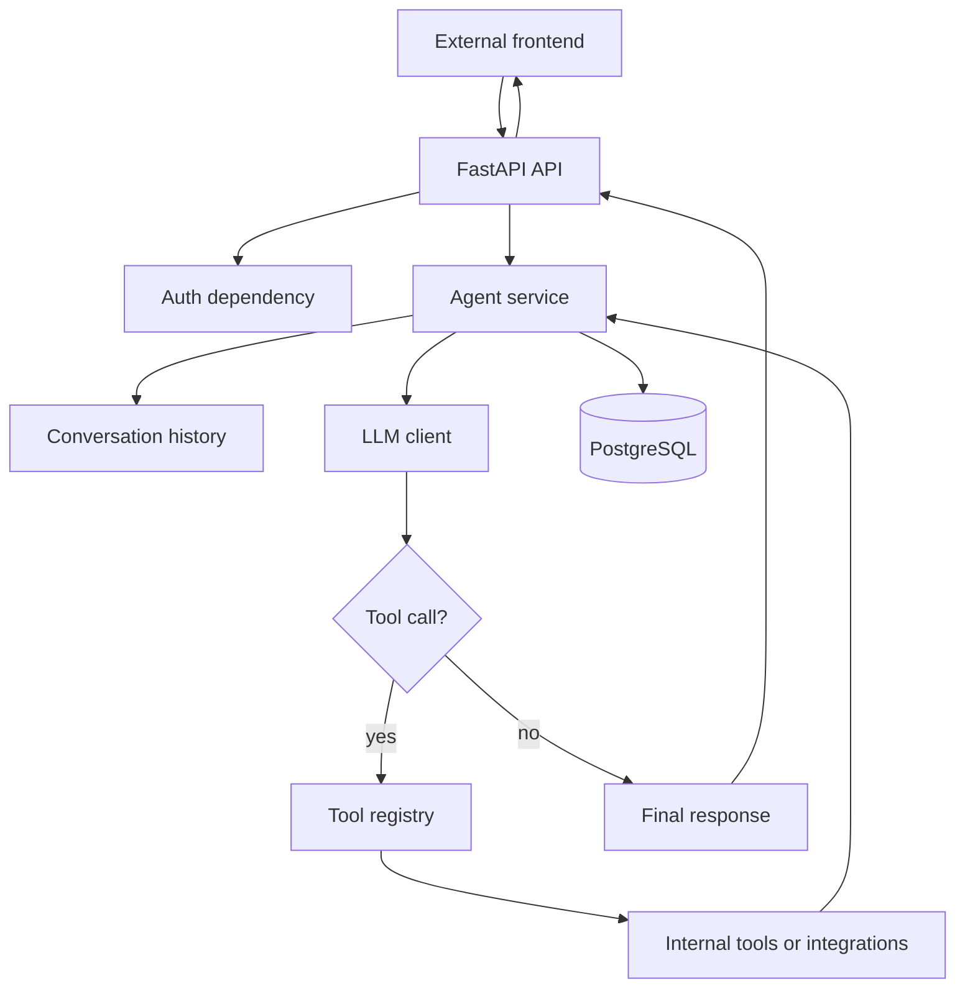
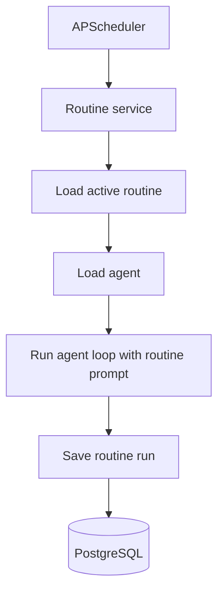

# AgentHub Design

## System Boundary

This repository owns the backend. The frontend will be built separately and will consume these APIs.

Backend responsibilities:

- auth
- user-scoped data access
- agent management
- conversation storage
- agent loop execution
- tool execution
- routine scheduling
- routine run logs
- external integrations

## High-Level Flow



## Routine Flow



## Data Model

### users

- id: UUID primary key
- email: unique string
- hashed_password: string
- created_at: datetime

### agents

- id: UUID primary key
- user_id: foreign key to users.id
- name: string
- instructions: text
- objective: text
- created_at: datetime
- updated_at: datetime

### conversations

- id: UUID primary key
- user_id: foreign key to users.id
- agent_id: foreign key to agents.id
- title: nullable string
- created_at: datetime
- updated_at: datetime

### messages

- id: UUID primary key
- conversation_id: foreign key to conversations.id
- role: enum: user, assistant, tool, system
- content: text
- tool_calls: nullable JSON
- created_at: datetime

### routines

- id: UUID primary key
- user_id: foreign key to users.id
- agent_id: foreign key to agents.id
- name: string
- prompt: text
- schedule: string
- timezone: string
- is_active: boolean
- created_at: datetime
- updated_at: datetime

### routine_runs

- id: UUID primary key
- user_id: foreign key to users.id
- routine_id: foreign key to routines.id
- agent_id: foreign key to agents.id
- status: enum: queued, running, succeeded, failed
- output: nullable text
- error: nullable text
- started_at: datetime
- finished_at: nullable datetime

### tool_action_logs

- id: UUID primary key
- user_id: foreign key to users.id
- agent_id: foreign key to agents.id
- routine_run_id: nullable foreign key to routine_runs.id
- tool_name: string
- input: JSON
- output: nullable JSON
- status: enum: succeeded, failed
- error: nullable text
- created_at: datetime

## API Design

All routes use `/api/v1`.

### Auth

- `POST /api/v1/auth/register`
- `POST /api/v1/auth/login`
- `POST /api/v1/auth/refresh`
- `POST /api/v1/auth/logout`
- `GET /api/v1/auth/me`

### Agents

- `POST /api/v1/agents`
- `GET /api/v1/agents`
- `GET /api/v1/agents/{agent_id}`
- `PATCH /api/v1/agents/{agent_id}`
- `DELETE /api/v1/agents/{agent_id}`

### Conversations

- `POST /api/v1/agents/{agent_id}/conversations`
- `GET /api/v1/agents/{agent_id}/conversations`
- `GET /api/v1/conversations/{conversation_id}`
- `POST /api/v1/conversations/{conversation_id}/messages`

### Routines

- `POST /api/v1/routines`
- `GET /api/v1/routines`
- `GET /api/v1/routines/{routine_id}`
- `PATCH /api/v1/routines/{routine_id}`
- `DELETE /api/v1/routines/{routine_id}`
- `POST /api/v1/routines/{routine_id}/run`
- `GET /api/v1/routines/{routine_id}/runs`

### Dashboard Data

- `GET /api/v1/dashboard/summary`
- `GET /api/v1/dashboard/recent-runs`
- `GET /api/v1/dashboard/action-items`

## Frontend Screens To Support

The frontend is out of scope for this repository, but APIs should support these screens:

- login/register
- agents list
- create/edit agent
- agent chat
- routines list
- create/edit routine
- routine run details
- dashboard summary
- integration connection status

## Agent Loop Design

1. Load the authenticated user.
2. Load the selected agent and verify ownership.
3. Load recent conversation history or routine context.
4. Build the LLM input from:
   - agent instructions
   - agent objective
   - user prompt
   - recent messages
   - available tool schemas
5. Call the LLM.
6. If the LLM requests a tool, validate and execute the tool.
7. Save the tool action log.
8. Add the tool result to the loop context.
9. Repeat until the LLM returns a final response or max iterations is reached.
10. Save final message or routine run output.

## Tool Categories

### Internal MVP Tools

- internship research tool
- date/time tool
- save report tool
- draft message tool

### Integration Tools

- Gmail read/summarize through Composio
- future Slack or email send through confirmation-gated flows

## Error Shape

```json
{
  "error": {
    "code": "string_code",
    "message": "Human readable message",
    "details": {}
  }
}
```

## Security Notes

- Every query must enforce user ownership.
- Access tokens should be short-lived.
- Refresh tokens should be stored and revocable.
- Passwords must be hashed.
- External tokens must never be returned to the frontend.
- Secrets must never be logged.
- Dangerous tool actions require explicit user configuration or confirmation.

