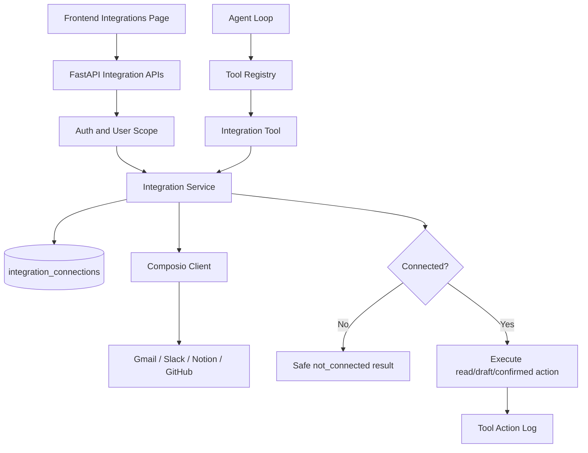

# AgentHub Integrations Plan

## Purpose

Integrations let agents safely connect to external services such as Gmail, Slack, Notion, GitHub, and later Google Calendar.

The goal is not to give the LLM direct access to accounts. The backend owns connection state, permissions, safety policy, and tool execution. The LLM can only request tools that are enabled for the agent and allowed by the backend.

## MVP Integration Principle

Start small and safe:

- Read-only integrations first.
- Draft/prepare actions before real sending.
- No destructive action without explicit confirmation.
- No OAuth/token secrets returned to frontend.
- Every integration connection is scoped by `user_id`.

## Current State

Already present:

- `GET /api/v1/integrations`
- `GET /api/v1/integrations/{provider}/status`
- `POST /api/v1/integrations/{provider}/connect`
- `POST /api/v1/integrations/{provider}/disconnect`
- user-scoped `integration_connections` records
- `app/integrations/composio_client.py`
- Composio hosted connect-link creation
- Composio connected-account status sync
- Gmail summary tool with safe mock fallback and Composio read path
- Notion/GitHub tool wrappers that return safe not-connected or confirmation-required outputs
- Frontend integrations page

Missing:

- hosted OAuth callback verification endpoint
- write-action confirmation endpoint for Notion/Slack/Gmail send flows
- richer provider-specific tool schemas after real Composio account testing
- integration run history UI

Required environment:

```text
COMPOSIO_API_KEY=
COMPOSIO_GMAIL_AUTH_CONFIG_ID=
COMPOSIO_NOTION_AUTH_CONFIG_ID=
COMPOSIO_GITHUB_AUTH_CONFIG_ID=
COMPOSIO_CALLBACK_URL=
```

## Integration Architecture



## Data Model

Recommended table: `integration_connections`

```text
integration_connections
├── id
├── user_id
├── provider
├── status
├── account_email
├── scopes
├── external_connection_id
├── metadata
├── connected_at
├── expires_at
├── created_at
└── updated_at
```

Important:

- Do not store raw OAuth tokens in the MVP unless encryption is implemented.
- If Composio stores credentials externally, store only Composio connection id and status.
- Queries must always filter by `user_id`.

## Provider Scope

### Gmail

MVP behavior:

- connection status
- read recent email summaries
- rank important emails
- extract action items

Blocked by default:

- send email
- delete email
- mark email read/unread automatically

### Slack

MVP behavior:

- prepare a Slack message
- return confirmation-required state

Later:

- send only after explicit allowlist/confirmation

### Notion

MVP behavior:

- prepare page creation payload
- return confirmation-required state

Later:

- create page after connected workspace and confirmation policy

### GitHub

MVP behavior:

- public issue/search style read-only lookup
- no write operations

Later:

- create issues only after confirmation

## API Plan

### Catalog

`GET /api/v1/integrations`

Returns all supported providers with current user status.

### Single Provider Status

`GET /api/v1/integrations/{provider}/status`

Returns status for one provider.

### Connect

`POST /api/v1/integrations/{provider}/connect`

MVP behavior:

- if provider can be configured through environment only, return configured/not configured
- if Composio OAuth is ready, return authorization URL or connection request data

### Disconnect

`POST /api/v1/integrations/{provider}/disconnect`

Marks current user's provider connection as disconnected.

### OAuth Callback Later

`GET /api/v1/integrations/{provider}/callback`

Completes OAuth connection after the external provider redirects back.

## Agent Tool Flow

```text
User asks agent to summarize Gmail
-> LLM requests gmail_summary
-> Tool registry validates tool enabled
-> Gmail tool asks integration service for status
-> if not connected: return safe not_connected output
-> if connected: fetch allowed data
-> save tool action log
-> LLM summarizes result for user
```

## Frontend Behavior

The integrations page should:

- load provider catalog from backend
- show connected/disconnected/not configured/error state
- show safe scopes
- connect only through backend APIs
- disconnect through backend APIs
- never ask user to paste secrets into random frontend state for real OAuth flows

## Build Order

1. Create backend integration catalog for Gmail, Slack, Notion, GitHub.
2. Add `integration_connections` model and migration.
3. Add user-scoped repository/service.
4. Add list/status/connect/disconnect endpoints.
5. Update frontend to use real list endpoint instead of static mixed data.
6. Wire Gmail summary tool to integration service status.
7. Add Composio OAuth flow after checking official API details.
8. Add confirmation workflow for write actions.

## Safety Rules

- Read-only tools can run after connection.
- Draft tools can prepare content without external transmission.
- Send/create/delete/apply tools require confirmation.
- Tool outputs must not expose credentials.
- Integration logs must never include tokens or API keys.
- A user can only see and modify their own integration records.

## Interview Explanation

The integration system is a controlled bridge between agents and external services. The LLM does not receive raw credentials or direct API access. It can request an integration tool, but the backend verifies the user, checks whether the provider is connected, enforces safety policy, executes only allowed actions, logs the result, and sends a safe tool output back to the LLM for the final response.
